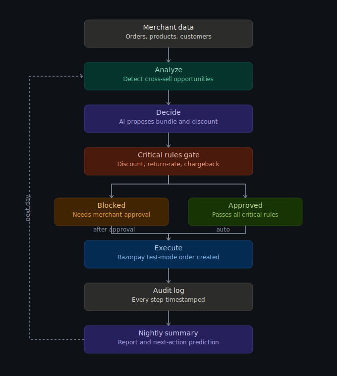

# Merchant Revenue Growth Agent

An agentic AI that analyzes a merchant's sales data, finds a real cross-sell
opportunity, proposes a bounded action, gates it against multi-tier merchant
policy, executes it via Razorpay (test mode), and logs everything - built as
a reusable engine for any merchant, not a one-off script.

**Agent loop:** Analyze → Decide → Critical Rules Gate → Act → Measure → Learn



## What it does

1. **Analyzes** order history to find products frequently bought together
   (e.g. 52.4% of shoe buyers also buy socks).
2. **Decides** on a bundle discount action, with a human-readable reason and
   an honest (not fabricated) expected-impact estimate.
3. **Checks 3 independent critical rules** before allowing any money action:
   - **Discount limit** - blocks excessive auto-discounts
   - **Return-rate guard** - blocks promoting products with high return rates
   - **Chargeback risk guard** - blocks if too many customers behind an
     opportunity have a fraud/chargeback history
   Each rule reports its own pass/fail with the exact numbers behind it -
   full explainability, not a black-box block.
4. **Acts**: on approval, creates a real Razorpay test-mode order for the
   discounted bundle.
5. **Logs** every step (opportunity → decision → block/approve → execution)
   to a timestamped audit trail.
6. **Measures & learns**: generates a plain-language nightly summary of the
   day's actions plus a prediction for tomorrow's top opportunity.
7. Includes a **simulate failure** button to prove the system never fakes
   a success.

## Multi-merchant by design

The engine ships with two independent demo merchants - **StrideSport**
(sportswear) and **UrbanGadget** (electronics) - each with its own dataset
and its own policy limits, to prove this isn't hardcoded to one business.
Switch merchants live from the dropdown in the UI.

## Run it

```bash
cd backend
pip install -r requirements.txt
uvicorn main:app --reload --port 8000
```

Open **http://localhost:8000** in your browser. That's it - frontend is
served by the same backend.

## Optional: live AI-generated reasoning

By default, the reasoning text and nightly summary are generated by a
deterministic, fully-traceable template - every number in the text comes
directly from real data. Optionally, the agent can generate that same text
via the Claude API for more natural language, with automatic fallback to
the template if the API call fails for any reason (no credits, rate limit,
network issue) - the app never breaks because of this layer.

```bash
export ANTHROPIC_API_KEY="sk-ant-xxxxxxxxxxxx"
```
Each API response includes a `reason_ai_generated` / `summary_ai_generated`
flag so you can see exactly which path produced the text.

## Optional: real Razorpay test-mode orders

By default the app runs in **mock mode** - it fakes Razorpay order
responses so the full loop works without a Razorpay account. To use real
Razorpay test-mode orders:

1. Sign up at https://dashboard.razorpay.com (free)
2. Go to **Account & Settings → API Keys → Test Mode → Generate Key**
3. Set environment variables before running the server:
```bash
   export RAZORPAY_KEY_ID="rzp_test_xxxxxxxxxxxx"
   export RAZORPAY_KEY_SECRET="xxxxxxxxxxxxxxxx"
```
4. Restart `uvicorn`. The `mock: true` flag will disappear from responses.
5. Test card for any checkout flow built on top of this:
   `4111 1111 1111 1111`, any future expiry, any CVV.

## Project structure
backend/
main.py # FastAPI app, all API routes
agent.py # Opportunity detection + decision engine + critical rules + nightly summary
llm_reasoning.py # Optional Claude API reasoning layer, with safe template fallback
razorpay_client.py # Razorpay test-mode Orders API wrapper (with mock fallback)
merchants/
stridesport.json # Demo merchant 1: sportswear
urbangadget.json # Demo merchant 2: electronics
frontend/
index.html # Single-page dashboard + demo UI (merchant switcher, rules, audit log, summary)
architecture-diagram.png

## API endpoints

| Method | Path | Purpose |
|---|---|---|
| GET | `/api/merchants` | List available merchants |
| GET | `/api/dashboard?merchant_id=...` | Merchant overview stats |
| GET | `/api/opportunities?merchant_id=...` | Detected cross-sell opportunities |
| POST | `/api/decide` | Build a bounded decision + evaluate all 3 critical rules |
| POST | `/api/approve/{decision_id}` | Manually approve a decision that failed a rule |
| POST | `/api/execute/{decision_id}` | Execute via Razorpay (add `?force_fail=true` to demo failure) |
| GET | `/api/audit-log?merchant_id=...` | Full audit trail |
| GET | `/api/nightly-summary?merchant_id=...` | Plain-language summary + next-action prediction |

## What's deliberately NOT built (by design, not oversight)

To keep the one core agentic loop excellent rather than spreading thin:
- No merchant login/auth (demo merchants are pre-loaded)
- No persistent database (in-memory audit log - fine for a demo)
- No voice assistant (evaluated, cut for time - low judging value relative to effort)
- No multiple opportunity types (one strong signal, well executed, per merchant)

## Relevant emerging standards (not implemented, acknowledged by design)

The agent's critical-rules gate is a simplified analogue of what emerging
agentic commerce protocols like Google's AP2 call a "mandate" - a bounded,
verifiable authorization for an agent to spend. Full cryptographic mandate
signing (AP2/ACP/UAP) was out of scope for the timeline, but the underlying
principle - bounded, explainable, gated financial actions - is the core of this build.